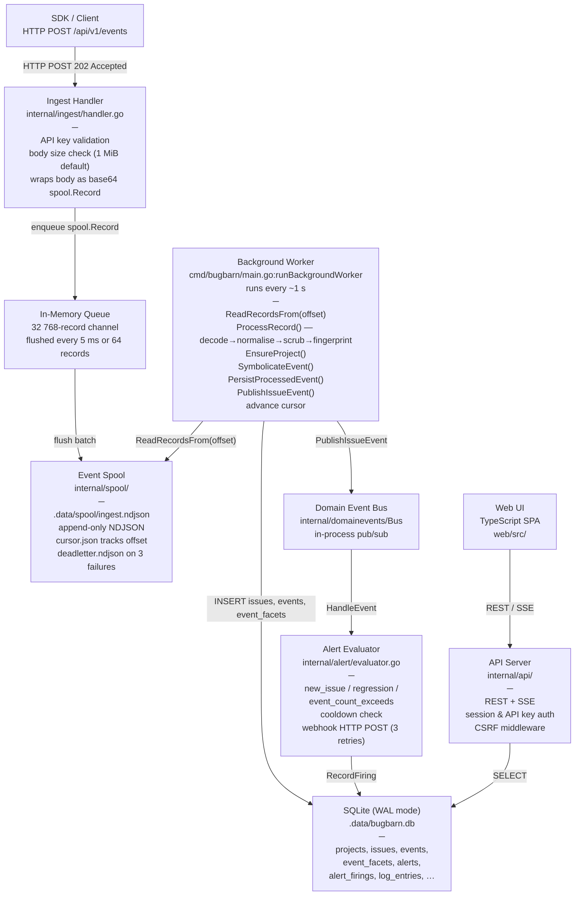

# BugBarn — Architecture Overview

## Three-Layer Design

BugBarn is structured as three distinct layers that decouple ingest throughput from database write latency and from API serving.

```
┌─────────────────────────────────────────────────────┐
│  Layer 1: Ingest (async, durable)                   │
│  POST /api/v1/events → spool file on disk           │
│  Returns 202 immediately; never blocks on DB write  │
└─────────────────────────────────────────────────────┘
                        │
                        ▼
┌─────────────────────────────────────────────────────┐
│  Layer 2: Processing (background worker goroutine)  │
│  Reads spool → normalise → scrub → fingerprint      │
│  → persist to SQLite → publish domain events        │
└─────────────────────────────────────────────────────┘
                        │
                        ▼
┌─────────────────────────────────────────────────────┐
│  Layer 3: Serve (API + UI)                          │
│  REST endpoints + SSE streams over SQLite reads     │
│  TypeScript SPA served as static files              │
└─────────────────────────────────────────────────────┘
```

### Why This Architecture

**SQLite-first.** The entire persistent state fits in a single WAL-mode SQLite file. There is no separate database server to operate, no connection pool to tune, and no network round-trip to storage. Operational complexity is minimal — backup is a file copy (or Litestream replication).

**Spool for durability.** The ingest handler never writes directly to SQLite. Instead it appends records to an append-only NDJSON file on disk and returns `202 Accepted` to the caller. If the background worker is slow, the spool absorbs the backlog without blocking producers. If the process crashes, the cursor file records the last successfully processed offset so no record is silently dropped.

---

## Full Data Flow



---

## Component Summary

| Component | File / Package | Responsibility |
|---|---|---|
| Ingest Handler | `internal/ingest/handler.go` | Validate API key, enforce body size limit, wrap event as `spool.Record`, enqueue to in-memory channel, return 202 |
| Spool | `internal/spool/spool.go` | Append-only NDJSON durability layer; cursor tracking; dead-letter file; 64 MiB rotation |
| Background Worker | `cmd/bugbarn/main.go` (`runBackgroundWorker`) | Tick every second, drain spool, process and persist records, advance cursor, rotate spool |
| Privacy Scrubber | `internal/privacy/scrub.go` | Redact sensitive keys and PII string patterns before fingerprinting and storage |
| Normaliser | `internal/normalize/normalize.go` | Canonical form of exception types and messages for consistent grouping |
| Fingerprinter | `internal/fingerprint/fingerprint.go` | SHA-256 over stable JSON material derived from exception type, message, stacktrace, and allowlisted context keys |
| Source Map Symbolication | `internal/sourcemap/symbolicate.go` | Translate minified JS stack frames to original positions using stored source maps |
| Domain Event Bus | `internal/domainevents/bus.go` | Synchronous in-process pub/sub; delivers `IssueCreated`, `IssueRegressed`, `IssueEventRecorded` events |
| Alert Evaluator | `internal/alert/evaluator.go` | Subscribes to bus, matches domain events to alert rules, enforces cooldown, fires webhook with retry |
| Alert Deliverer | `internal/alert/deliverer.go` | HTTP POST to webhook URL; 3 retries with 1 s / 2 s / 4 s backoff; 5 s per-attempt timeout |
| Storage | `internal/storage/` | SQLite persistence: upsert issues, insert events, persist facets, manage projects, API keys, alerts, log entries |
| API Server | `internal/api/server.go` | HTTP router; session and API key authentication; CSRF middleware; REST endpoints; SSE streams |
| Log Stream Hub | `internal/logstream/hub.go` | In-memory fan-out of log entries to SSE subscribers; buffer 64 entries; non-blocking sends |
| Digest Scheduler | `internal/digest/scheduler.go` | Weekly summary delivery via SMTP and/or webhook |
| Web UI | `web/src/` | TypeScript single-page application; consumes REST and SSE endpoints |

---

## Concurrency Model

BugBarn runs as a single OS process. The table below lists every goroutine that is active during normal operation.

| Goroutine | Started in | What it does |
|---|---|---|
| **HTTP server** | `main.go` | Accepts and handles all inbound HTTP connections; one goroutine per connection spawned by `net/http` |
| **Ingest flusher** | `ingest.Handler.Start` | Drains the 32 768-record in-memory channel; flushes batches to the spool file every 5 ms or every 64 records |
| **Background worker** | `main.go:runBackgroundWorker` | Ticks every second; reads new records from spool; processes, persists, and publishes domain events |
| **Alert webhook** | `alert/evaluator.go` (per firing) | Short-lived goroutine per alert firing; HTTP POST with retry; bounded by 30 s context |
| **Digest scheduler** | `digest.StartScheduler` | Sleeps until the next configured weekday + hour; delivers weekly digest |
| **Login limiter cleanup** | `api.Server.cleanupLoginLimiter` | Periodically evicts stale login attempt records from the in-memory map |

The domain event bus (`domainevents.Bus`) publishes **synchronously** from the background worker goroutine. Alert evaluation is initiated in that same goroutine; the actual HTTP webhook delivery is offloaded to a new goroutine per firing so a slow webhook does not stall the worker.

SQLite access is serialised through a single `*sql.DB` connection (`db.SetMaxOpenConns(1)`). WAL mode allows concurrent reads from the API server while the worker holds a write transaction.

---

## Trade-offs

**Single-node only.** There is no sharding, no replication of the application tier, and no distributed coordination. A single BugBarn binary owns the spool directory and the SQLite file. Horizontal scaling is not supported.

**SQLite WAL mode.** WAL (Write-Ahead Logging) allows readers to proceed concurrently with a single writer without blocking. `synchronous=NORMAL` means SQLite syncs at checkpoints rather than after every write, which improves throughput at the cost of a small durability window (data written since the last checkpoint could be lost in a hard crash). For most self-hosted error-tracking workloads this is an acceptable trade-off.

**No message broker.** The spool is a simple append-only file. It is not a distributed queue. It provides durability across process restarts but not across machine failures unless the `.data/` directory is on durable storage (network volume, Litestream-replicated block device, etc.).

**Litestream for replication.** Continuous off-site replication of the SQLite database is delegated to [Litestream](https://litestream.io/), which runs as a separate process alongside BugBarn. BugBarn itself has no knowledge of Litestream; it simply writes a standard WAL-mode SQLite file. See [storage.md](storage.md) for the relevant environment variables.
