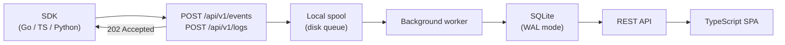

# BugBarn Overview

BugBarn is a lightweight, self-hosted error tracking system built in Go with SQLite. It is designed for individual developers, small teams, and self-hosters who want error visibility without the cost or privacy tradeoffs of a SaaS provider such as Sentry.

A single binary with no external runtime dependencies. Drop it on a server, point your SDKs at it, and errors start appearing.

---

## Who it is for

- Individual developers running personal projects on a VPS or home server
- Small teams that want full control over where error data lives
- Anyone who finds hosted error tracking too expensive or too invasive for their use case

---

## The problem it solves

When something breaks in production you need to know: what happened, where in the code, how often, and whether it is new or recurring. Hosted error trackers solve this well but at a cost — monthly fees that scale with event volume, and your stack traces and user data leaving your infrastructure.

BugBarn stores everything locally in a SQLite file. Events are accepted asynchronously, grouped into issues by fingerprint, and surfaced through a TypeScript SPA. No external services required, no data leaves your server.

---

## Key capabilities

- **Issue grouping** — errors are grouped by a SHA256 fingerprint (a unique signature derived from the error type, message, and stack trace — identical errors group into one issue) derived from exception type, message, stack trace, and stable context keys (keys that reliably identify where the error came from, like service name, environment, and HTTP route). Duplicates collapse into a single issue rather than flooding your feed.
- **Issue statuses** — unresolved, resolved, regressed, muted (until next regression or forever). Resolved issues automatically reopen when a new event arrives.
- **Alerts** — rule-based notifications on `new_issue`, `regression`, and `event_count_exceeds` (with a configurable threshold). Delivers to Slack (Block Kit), Discord (Embeds), or any generic webhook. Retries three times with backoff; configurable cooldowns.
- **Weekly digest** — one email per week summarising all projects with activity: total events, new issues, resolved issues, regressions, and the top five issues per project. Also fires a JSON webhook.
- **Log ingestion and streaming** — structured log lines accepted via POST and streamed to the UI in real time via Server-Sent Events. Filterable by level and search string.
- **Releases** — track deployments against issues.
- **Multi-project** — all data is project-scoped. A single BugBarn instance serves any number of projects. An all-projects view aggregates across them.
- **Source map symbolication** — JavaScript stack traces are symbolicated server-side using uploaded source maps.
- **Privacy scrubbing** — automatic redaction of sensitive keys (`password`, `token`, `secret`, `email`, `cookie`, `authorization`, `api_key`, `session`, `csrf`) and pattern-matched values (email addresses, IPs, UUIDs, bearer tokens) before storage.
- **Self-reporting** — BugBarn can report its own errors to itself (dogfooding).
- **SDKs** — official clients for Go (`bugbarn-go`), TypeScript, and Python. All support `Init`, `CaptureError`, `CaptureMessage`, and `Shutdown`.
- **Authentication** — session cookies (HMAC-signed, bcrypt passwords) or API keys (SHA256-hashed, scoped to `full` or `ingest`, optionally per-project).

---

## Performance

BugBarn is designed to stay out of the way of your application. The ingest path is non-blocking by design: when your SDK sends an error event, the HTTP handler writes it to an in-memory queue and returns 202 Accepted immediately — it never touches the database during that request. A background flush writes batches to a durable spool file on disk every 5 milliseconds or every 64 records, whichever comes first. Your application's error-reporting call completes in microseconds regardless of what the database is doing.

Go's goroutine model means the HTTP server handles thousands of concurrent connections with negligible overhead and no configuration required. Each connection gets its own lightweight goroutine; the runtime multiplexes these across available CPU cores automatically. Ingest throughput is limited by network bandwidth and JSON parsing speed — on modest hardware such as a Raspberry Pi 4 or a single-core VPS, the ingest path can saturate a gigabit network link before the application becomes the bottleneck.

The spool acts as a shock absorber. If your application fires a burst of thousands of events in a short window, they are accepted immediately and queued to disk. A single background worker then reads the spool and processes events at its own pace — normalising, fingerprinting, and writing to SQLite — without any of that work affecting ingest latency. This deliberately single-threaded design avoids write contention on SQLite. SQLite in WAL (Write-Ahead Logging) mode allows all read API endpoints to run concurrently and independently while the writer is active, so the dashboard stays fast even during heavy ingestion.

When limits are reached, BugBarn degrades gracefully. If the spool grows beyond the configured maximum size (`BUGBARN_MAX_SPOOL_BYTES`), ingest returns 429 Too Many Requests with a `Retry-After` header rather than writing to disk indefinitely. Log entries are trimmed to the most recent 10,000 per project on each insert. Facet keys and values beyond the cardinality limits are silently dropped rather than causing errors.

BugBarn runs comfortably on a Raspberry Pi or a $5 VPS; it scales up with the hardware it runs on. See [Performance and limits](deployment/performance.md) for hardware recommendations and detailed throughput guidance.

---

## What BugBarn is NOT

- **Not an APM tool.** BugBarn tracks errors and logs. It does not instrument performance, traces, or metrics.
- **Not horizontally scalable.** SQLite means a single writer. The deployment strategy is `Recreate` (not `RollingUpdate`). You run one replica. If you need multi-region active-active error ingestion, BugBarn is the wrong tool.
- **Not a Sentry replacement at scale.** It handles the use cases that matter for small deployments. High-volume, enterprise-scale ingestion is out of scope.

---

## Architecture

Events flow through a durable local spool so the ingest endpoint can return immediately and never block the caller waiting for a database write.

**Litestream** can optionally replicate the SQLite WAL to object storage for disaster recovery.

---

## Further reading

- [Getting started](getting-started.md) — run BugBarn locally and send your first error in under five minutes
- [Architecture](architecture.md) — database schema, spool format, background workers, and SSE
- [Operations](operations.md) — production deployment, Kubernetes manifests, Litestream, backup and restore
